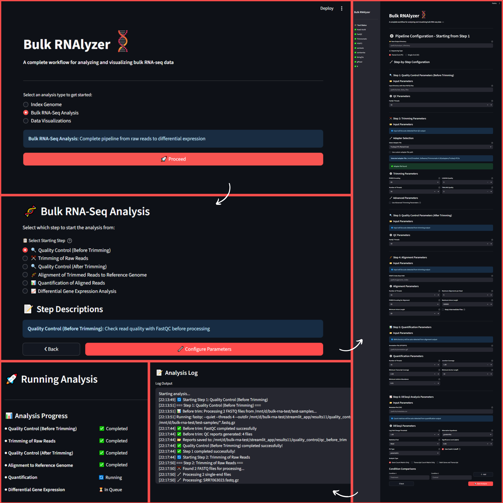
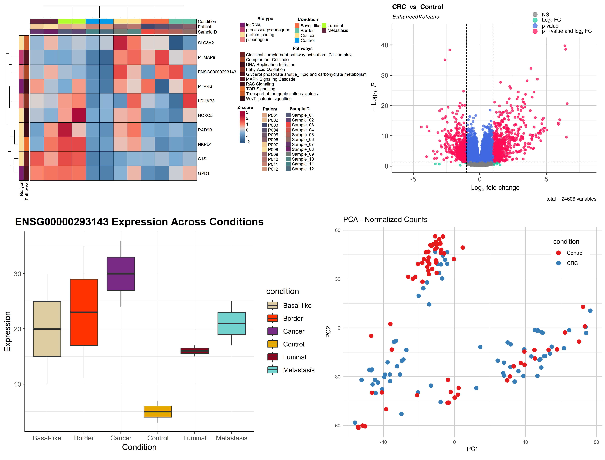

## 📑 Table of contents

1. [📝 Overview](#-overview)
2. [📦 Installation](#-installation)
3. [🏃 How to run](#-how-to-run)
4. [📂 Input file formats & expected structure](#-input-file-formats--expected-structure)
5. [🔄 App workflows and usage](#-app-workflows-and-usage)
   - [1. Genome Indexing Workflow](#1-genome-indexing-workflow)
   - [2. Bulk RNA-Seq Analysis Workflow](#2-bulk-rna-seq-analysis-workflow)
   - [3. Data Visualization Workflow](#3-data-visualization-workflow)
6. [📚 Citation](#-citation)
7. [🤝 Acknowledgements](#-acknowledgements)

## 📝 Overview
<p align="justify"> <b>Bulk RNAlyzer</b> is a comprehensive web-based application built with Streamlit that provides a complete workflow for analyzing and visualizing bulk RNA-seq data. This user-friendly interface allows researchers to perform end-to-end RNA-seq analysis without requiring extensive command-line expertise. </p>

#### 🛠️ Pipeline Overview

| Description | Tools Used |
|--------------|-------------|
| Quality Control | FastQC |
| Reads Trimming | Trimmomatic |
| Alignment to Reference Genome | HISAT2 |
| Quantification | StringTie |
| Differential Expression Analysis | DESeq2 |
| Data Visualizations | ComplexHeatmap |

#### ✨ Key Features

- User-Friendly Interface: No command-line expertise required.
- Flexible Starting Points: Begin bulk RNA-seq analysis from any step in the pipeline.
- Interactive Visualizations: Generate publication-quality heatmaps, boxplots, volcano plots, and PCA plots.
- Comprehensive Output: Provides detailed reports and summary statistics.
- Multi-Condition Comparison: Supports comparison of multiple combinations of conditions when more than two conditions are present.
- Normalized Data Output: Produces normalized gene and transcript count matrices.
- Detailed DEG Results: Outputs overall DEG CSV, gene summary CSV, and gene biotype-specific DEG CSV files, along with .rds objects and associated visualizations.

## 📦 Installation

#### Create conda environment

```
conda create -n bulkrnalyzer python=3.11 -y
```

```
conda activate bulkrnalyzer
```

#### Install tools for bulk RNA-seq analysis

#### 1. Fastqc:

```
sudo apt install fastqc -y
```

#### 2. Trimmomatic

- Download the binary from the official [website](http://www.usadellab.org/cms/?page=trimmomatic) or build from [source](https://github.com/usadellab/Trimmomatic)

#### Note: Trimmomatic is included in this repository. To use a different version, download the desired binary, replace the existing Trimmomatic folder, and update the file path in the `config.py` file accordingly.

#### 3. HISAT2

- Using the `HISAT2` officical [link](https://daehwankimlab.github.io/hisat2/download/#version-hisat2-221), download the binary or install from [source code](https://github.com/DaehwanKimLab/hisat2)
- After downloading/installing, add `HISAT2` directory to System's PATH:

a. Open the `.bashrc` file in nano:

```
nano ~/.bashrc
```

b. Add the path of the `HISAT2` directory at the end of the `.bashrc` file:

```
export PATH=$PATH:/path/to/hisat2/directory
```

c. Save changes and exit:

- `Ctrl + O` Save
- When prompted for filename, press `Enter`
- `Ctrl + X` Exit

d. Reload shell:

```
source ~/.bashrc
```

e. Verify by running:

```
hisat2-build
```

#### 4. Samtools

```
sudo apt install samtools -y
```

#### 5. Sambamba

```
sudo apt install sambamba -y
```

#### 6. gffread

```
sudo apt install gffread -y
```

#### 7. StringTie

```
sudo apt install stringtie -y
```

#### 🐍 Install Python Dependencies

```
pip install streamlit pandas numpy pathlib subprocess -y
```

#### Install R Packages

- Open a terminal and run:

```
Rscript install_rpackages.R
```

## 🏃 How to run

**Navigate to the directory containing the `main.py` file and run in terminal:**

```
streamlit run main.py
```

The application will open in your default web browser at `http://localhost:8501`

## 📂 Input file formats & expected structure

#### Bulk RNA-Seq Analysis Inputs

**Raw Sequencing Data**

- Format: FASTQ files (compressed .fastq.gz preferred)

**Sample Metadata**

- Format: CSV
- Required Columns: Sample identifiers (matching FASTQ file names), Condition/treatment groups, etc (for DGE analysis, only 2 columns including sample and condition are enough)
- All column names should be in lowercase
- Example Structure:

| sample | condition | time_point | batch |
|-----------|-----------|------------|-------|
| SRR7063023 | treated | 24h | batch1 |
| SRR7063025 | control | 24h | batch1 |

**Reference Files**

- Genome Assembly: FASTA format (.fa, .fasta)
- Gene Annotations: GTF or GFF3 format
- Adapter Sequences: FASTA format

**Count Matrices**

- Gene Count Matrix: CSV with genes as rows, samples as columns
- Transcript Count Matrix: CSV with transcripts as rows, samples as columns
- Required Columns for gene count matrix: gene_id, gene_symbol, gene_biotype, chr, start, end, strand, and sample columns
- Required Columns for transcript count matrix: transcript_id, gene_id, gene_name, transcript_name, gene_biotype, transcript_biotype, chr, start, end, strand, and sample columns
- Example Structure:

**Gene Count Matrix File:**

| gene_id        | gene_symbol | gene_biotype                        | chr | start | end   | strand | SRR7063023_dedup | SRR7063024_dedup | SRR7063025_dedup | SRR7063026_dedup |
|----------------|--------------|-------------------------------------|-----|--------|--------|---------|------------------|------------------|------------------|------------------|
| ENSG00000290825 | DDX11L16    | lncRNA                              | 1   | 11121  | 24894  | +       | 0                | 0                | 2                | 1                |
| ENSG00000223972 | DDX11L1     | transcribed_unprocessed_pseudogene  | 1   | 12010  | 13670  | +       | 0                | 0                | 0                | 0                |
| ENSG00000310526 | WASH7P      | lncRNA                              | 1   | 14356  | 30744  | -       | 142              | 191              | 208              | 223              |

**Transcript Count Matrix File:**

| transcript_id   | gene_id        | gene_name | transcript_name | gene_biotype   | transcript_biotype | chr | start     | end       | strand | SRR7063023_dedup | SRR7063024_dedup | SRR7063025_dedup | SRR7063026_dedup |
|-----------------|----------------|------------|------------------|----------------|--------------------|-----|------------|------------|---------|------------------|------------------|------------------|------------------|
| ENST00000000233 | ENSG00000004059 | ARF5       | ARF5-201         | protein_coding | protein_coding     | 7   | 127588411  | 127591700  | +       | 352              | 319              | 703              | 557              |
| ENST00000000412 | ENSG00000003056 | M6PR       | M6PR-201         | protein_coding | protein_coding     | 12  | 8940361    | 8949645    | -       | 397              | 389              | 538              | 525              |
| ENST00000000442 | ENSG00000173153 | ESRRA      | ESRRA-201        | protein_coding | protein_coding     | 11  | 64305524   | 64316743   | +       | 197              | 276              | 161              | 483              |

#### Note: File format details are provided to ensure count matrices are properly formatted when starting the workflow, specifically from the DGE analysis step.

#### Visualization Inputs

- Normalized count matrices
- Example Structure:

| gene_id        | gene_symbol | Sample1      | Sample2      | Sample3      | Sample4      | Sample5      |
|----------------|--------------|--------------|--------------|--------------|--------------|--------------|
| ENSG00000290825 | Gnai3       | 2956.925239  | 4583.019379  | 3852.331432  | 3721.390533  | 4052.056950  |
| ENSG00000223972 | Cdc45       | 410.0919315  | 364.9031354  | 329.1442723  | 460.6246055  | 373.1668664  |
| ENSG00000310526 | H19         | 1132.828207  | 830.6671374  | 1043.689618  | 1329.184445  | 235.6452124  |
| ENSG00000243485 | Scml2       | 16.24126461  | 27.06023251  | 42.82234155  | 56.4916969   | 130.088051   |

#### Note: File format details are provided to ensure normalized count matrices are properly formatted when using the visualization workflow.

**Visualization Parameters**

- Gene Lists: Comma-separated gene names
- Plot Dimensions: Customizable width and height in pixels
- Color Palettes: Multiple predefined color schemes available

## 🔄 App Workflows and Usage



The application provides three main analysis types:

- Index Genome - Build reference genome indexes
- Bulk RNA-Seq Analysis - Complete pipeline from raw reads to differential expression
- Data Visualizations - Create box-plots and heatmaps from analysis results

#### 1. Genome Indexing Workflow

- Create custom `HISAT2` reference genome indexes for alignment, including support for `transcript-aware` and `SNP-aware` indexing.

Select Index Type:

- HFM (basic genome index)
- HGFM with transcripts
- HGFM with SNPs
- HGFM with SNPs and transcripts

Input Files:

- Genome FASTA file
- Annotation file (GTF/GFF3) for transcript-aware indexing
- VCF file for SNP-aware indexing

Parameters:

- Number of threads
- Large index option (for genomes >4 billion bases)
- Off-rate value (controls index density)
- Output: HISAT2 index files (.ht2)


#### 2. Bulk RNA-Seq Analysis Workflow

Start analysis from any step in the pipeline:

| Steps | Description           | Input Requirements |
|------|-----------------------|--------------------|
| 1️⃣ | **QC Before Trimming** | Raw FASTQ files |
| 2️⃣ | **Reads Trimming** | Raw FASTQ files, Adapter sequences |
| 3️⃣ | **QC After Trimming** | Trimmed FASTQ files |
| 4️⃣ | **Alignment** | Trimmed FASTQ files, HISAT2 index |
| 5️⃣ | **Quantification** | BAM files, Annotation file |
| 6️⃣ | **DESeq2 Analysis** | Count matrices, Metadata file |

**Step 1: Quality Control (Before Trimming)**

- Tool: FastQC
- Output: HTML reports with quality metrics
- Assess raw read quality before processing

**Step 2: Read Trimming**

- Tool: Trimmomatic
- Parameters:
   - PHRED encoding (33/64)
   - Leading/Trailing quality thresholds
   - Optional: Sliding window trimming, minimum length
   - Adapter Selection: Built-in Trimmomatic adapters or custom adapter sequences
- Output: Trimmed FASTQ files (*_paired.fastq.gz, *_unpaired.fastq.gz)

**Step 3: Quality Control (After Trimming)**

- Tool: FastQC
- Verify trimming effectiveness and final read quality
- Output: Post-trimming quality reports

**Step 4: Alignment**

- Tools: HISAT2, SAMtools, and Sambamba
- Parameters:
   - Number of threads
   - Maximum alignments per read
   - Intron length boundaries
   - Keep intermediate files option

- Process:
   - HISAT2 alignment to generate SAM files
   - SAM to sorted BAM conversion (SAMtools)
   - Duplicate marking (Sambamba)
   - BAM indexing (SAMtools)
- Output: Deduplicated, sorted BAM files with indexes

**Step 5: Quantification**

- Tool: StringTie
- Parameters:
   - Minimum transcript coverage
   - Minimum isoform abundance
   - Junction coverage
   - Annotation Handling: Automatic GFF3 to GTF conversion if needed
- Output:
   - Gene count matrix (gene_count_matrix.csv)
   - Transcript count matrix (transcript_count_matrix.csv)

**Step 6: Differential Expression Analysis**

- Tool: DESeq2 (R package)
- Parameters:
   - Statistical test (Wald or LRT)
   - Log fold change threshold
   - Significance level (alpha)
   - Fit type (parametric, local, mean)
- Comparison Setup:
   - Wald test: Define condition contrasts
   - LRT test: Select model combinations
- Output:
   - Normalized count matrices
   - Differential expression results
   - PCA plots, volcano plots, heatmaps
   - Biotype-specific results

#### 3. Data Visualization Workflow

**🔥 Heatmaps**

- Features:
   - Z-score normalized expression
   - Pre-defined color schemes
   - Row and column annotations
   - Publication-ready resolution

**📦 Boxplots**

- Features:
   - Individual gene/transcript expression
   - Condition-wise comparisons
   - Pre-defined color palettes
   - Multiple genes in separate plots



#### Note: Sample files for raw count matrices, normalized count matrices, metadata, and annotation are provided in the `sample_files` directory.

## 📚 Citation

If you use Bulk RNAlyzer in your research, please cite:

```
Bulk-RNAlyzer. GitHub: https://github.com/usman4373/Bulk-RNAlyzer
```

## 🤝 Acknowledgements

- Bulk RNAlyzer builds upon the work of open-source bioinformatics tools and libraries.
- Please also cite the tools used in the analysis pipeline:
   - HISAT2 - For efficient and sensitive alignment of RNA-seq reads
   - FastQC - For comprehensive quality control of sequencing data
   - Trimmomatic - For flexible trimming of sequence data
   - StringTie - For accurate transcript quantification and assembly
   - DESeq2 - For robust differential expression analysis
   - SAMtools - For handling high-throughput sequencing data
   - Sambamba - For fast and efficient processing of BAM files
   - ComplexHeatmap - For creating sophisticated heatmaps
   - ggplot2 - For elegant data visualization
   - EnhancedVolcano - For publication-ready volcano plots
   - Streamlit - For creating interactive web applications with Python
   - Pandas - For data manipulation and analysis
   - Other open-source tools

---
